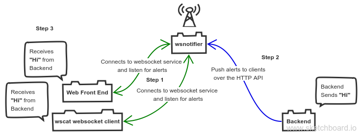

# wsnotifier

wsnotifier is a lightweight [gevent](http://www.gevent.org/) based asynchronous websocket Server written in Python. wsnotifier exposes HTTP APIs for forwarding the messages to the websocket clients. This makes it easier to use the service with any web application. It's completely written in Python and doesn't depend on external systems like Redis for storing/retrieving messages.

## Installation

You can install using `pip`

	$ pip install git+https://github.com/semk/wsnotifier.git

Or using docker

	$ docker pull semk/wsnotifier

## Running wsnotifier server

	$ wsnotifier
	Starting wsnotifier on ws://0.0.0.0:1729/alerts and http://0.0.0.0:1729/alerts

Or using docker

	$ docker run -p 1729:1729 --rm -it semk/wsnotifier
	Starting wsnotifier on ws://0.0.0.0:1729/alerts and http://0.0.0.0:1729/alerts

## Connecting to wsnotifier via a websocket client

`wscat` is a nice commandline websocket client. You can install it by

	$ npm install -g wscat

Connect to the websocket server at `ws://0.0.0.0:1729/alerts`

	$ wscat -c ws://localhost:1729/alerts
	connected (press CTRL+C to quit)

## Posting messages to wsnotifier for forwarding to websocket clients.

You can use any HTTP client to send the messages. This will be forwarded to all the connected websocket clients asynchronously. A Python client for wsnotifier is available [here](wsnotifier/notify.py)

	$ curl -X POST -H "Content-Type: application/json" -d '{"id": "unique-message-id", "type": "important", "message": "important message"}' http://0.0.0.0:1729/alerts
	{"status": "success"}

You can see the forwarded message appearing on the `wscat` client instantly.

	$ wscat -c ws://localhost:1729/alerts
	connected (press CTRL+C to quit)
	< {"message": "important message", "type": "important", "id": "unique-message-id"}
	>
